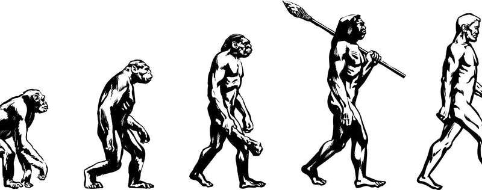
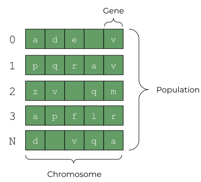

The **genetic algorithm** is a search heuristic inspired by Darwin's theory of evolution.  This algorithm borrows the following concepts from natural selection:

+ Each individual (solution) has an associated fitness score
+ Individuals with high fitness scores are selected for reproduction
+ Chosen individuals reproduce to create offspring with the characteristics of both parents
+ Some offspring would have random mutations applied to them

The idea is that if the parents have high fitness, the offspring would have high fitness as well.

This entire process of **selection**, **reproduction** (more commonly known as crossover), and **mutation** will repeat many times. At the end, only the fittest individuals will remain. These fittest individuals represent the solutions to our problem.

> Only the fittest will survive - Charles Darwin

Before diving deeper, let's first understand what genetic algorithms are trying to solve.

## The Infinite Monkey Theorem

The infinite monkey theorem pictures a monkey hitting keys at random on a typewriter.

It suggests that if the monkey hits on the keyboard for an infinite amount of time, it will be able to type any given text. Yes, even the works of William Shakespeare.

Although, the probability of doing so is extremely low.

Let's see an example.

Imagine that the monkey has a primitive keyboard with only 27 characters. These are the small letters a to z and the space character.

The monkey's task is to write the phrase: if music be the food of love play on.

How likely will the monkey write this phrase?

To write "i": 1/27

To write "if": 1/27 * 1/27

To write the entire phrase (36 characters, including spaces): (1/27)^36

In other words, the probability of the monkey typing this phrase in random is:

1 in  3,381,391,910,000,000,000,000,000,000,000,000,000,000,000,000,000,000.

And even if the monkey were able to write one million phrases per second, to be able to write this phrase randomly at least *once*, it would take this much time:

**5,142,335,400,000,000,000,000,000,000,000,000,000,000,000,000 years**

(As a comparison, the universe is only 13,800,000,000 years old)

Nobody has this kind of time. So, how can we improve this?

## The Power of Genetic Algorithms

The answer is through genetic algorithms. Genetic algorithms arrive at a solution magnitudes faster than brute force search. To do so, it uses the following two ideas:

+ Some solutions are better (or more fit) than others
+ We combine fit solutions with each other to get a high chance of getting fitter solutions

We'll discuss these two ideas more shortly, but for now, keep them in mind. Genetic algorithms make use of these ideas in 6 different steps:

Let's discuss them one by one.

## Initial Population

Genetic algorithms begin by defining a set of individuals called a population. Each of these individuals is a potential solution to the problem you want to solve.

Each individual is defined by a set of parameters called genes. These genes are joined together to define an individual's chromosome. It's the individuals' chromosomes that define our solution.

But what should these parameters be?

It depends on the problem, but generally, the set of genes comes from a pre-defined alphabet. Usually, this alphabet is the binary alphabet: each gene can have a value of 1 or 0 (chosen at random).

In our case, we want each of our individual (solution) to be a guess of the phrase: if music be the food of love play on. To create solutions for this, we need a much more sophisticated alphabet than 1s and 0s.

What we can do is define our alphabet to be 27 characters: small letters a to z and the spacebar. Each individual defines itself by a string of small letter characters (and the spacebar). 

For example, if we were trying to solve for the word apple, our solutions would look like the following:

These are all randomized strings that are 5 characters long. As you can see, the solutions can range from being completely off the mark to being close to the target. There’s even a possibility to get the solution on the first try!

What we want to do is to tell our algorithm that we should choose more solutions that are closer to our target. By eliminating bad solutions and choosing the ones that are closer to our target, we can converge to the right solution faster.

But how can we tell how good (fit) each solution is? That’s what the fitness function is for.

## Fitness Function
The fitness function determines how "fit" or how good a solution an individual is. The fitness function assigns a fitness score to an individual based on its genes.

Individuals with a higher score are more likely to be chosen at random for the next generation of individuals. By selecting individuals close to our solution, we can ignore all the other solutions that are off the mark.

You can define the fitness function any and which way that you want. That's what makes it powerful. It can be flexible enough to accommodate any problem.

In our case, we can define it as "the number of matching characters in our individual and the target phrase." So for example, if we were trying to guess the phrase apple, these individuals will be scored as follows:

Since the second and third solutions are closer to our target, we want to prioritize those two over the first solution.

## Selection

The selection phase lets us select the fittest individuals and allow them to pass their genes to the next generation. The individuals chosen in this phase are called the parents.

There are many ways to select the parents. One of the most common ways is called Roulette Wheel Selection or Fitness Proportionate Selection. As the name suggests, the probability of choosing an individual is proportionate to its fitness score.

## Crossover

Crossover is the workhorse of genetic algorithms. It allows the parents (chosen from the selection phase) to exchange their genes.

The idea is that if we exchange the genes of two fit solutions, we'll arrive at a solution that's fitter.

Like selection, there are many different ways we can perform crossover. The simplest is Single Point Crossover. For each pair of parents we chose during selection, we create new individuals (offspring) by:

1. Choosing a random crossover point from the genes
2. Selecting genes from the first parent until we reach the crossover point
3. Selecting genes from the second parent until the end of the string

These offspring are then added to the new population.

## Mutation

When we create our initial population, we also define the genes that are present in the population. During crossover, these genes are exchanged amongst each individual to arrive at our solution.

But what if we never get genes that are required for the solution? Going back to the apple example, what if our individuals, never randomly generate the letter a? Crossover only exchanges existing genes. Even if we perform crossover till the end of time, we will never find our solution.

To resolve this, we perform mutation. Mutation is as the name suggest. We subject a gene to mutate (in our case, to a different random letter) with a low random probability.

This allows us to maintain diversity in our population and ensure that we arrive at a solution.

## Stop Condition
The algorithm repeats the loop until the population has either:

+ Converged (the generated offspring isn't much different from the previous generation)
+ Reached a certain number of generations

Once the algorithm stops, we can say that the final set of individuals is the solution to our problem.

## Solving the Infinite Monkey Theorem
Let’s see how we can apply what we learned to solve the infinite monkey theorem.
As a refresher, we are trying to solve for the phrase if music be the food of love play on. 

This phrase has 36 characters, so each individual will have a chromosome with 36 genes. Each gene will start with a randomized lowercase letter (or space). A chromosome represents a potential solution of the phrase.

The fitness value of each chromosome is calculated based on how many characters it got correct in the proper position. A chromosome that guesses the phrase exactly has a perfect fitness score of 36. A chromosome with no correct characters, on the other hand, has a fitness score of 0.

The aim of our genetic algorithm is to maximize the fitness function. So, individuals with higher fitnesses are selected over individuals with low fitnesses. At the end, we expect our population to have an individual with the perfect score of 36.

By doing this, we can achieve the following result:

Here are some few comments about it:

+ For each iteration, the algorithm loops through the process we described above until either A) it reaches the maximum of 10,000 generations, or B) it reaches our target phrase.
+ Out of the total population of 5000, the top 50 solutions are displayed.
+ The right number shows the fitness, i.e. the number of correct genes in the solution.
+ Incorrect genes have a red background.
+ The solutions are ordered according to fitness, with the solution with the highest fitness on top and the one with the lowest fitness at the bottom.

In the next part of this series, we’ll walk step by step on how to code this. For the curious, here’s where you can find the [final result](https://stoic-hoover-d22e34.netlify.app/) and the [source code](https://github.com/adrianmarkperea/introduction-to-genetic-algorithms).

***Note: since genetic algorithms are relatively resource intensive, the demo might be slow on mobile.***

## Conclusion

Genetic algorithms are algorithms inspired by Darwin’s theory of evolution. In a nutshell, it uses:

+ Natural selection to select the best solutions to a problem 
+ Crossover mix the best solutions to create even better solutions
+ Mutation in order to maintain diversity in the population

Through these, best solutions are kept and bad solutions are removed quickly. This allows us to arrive at the ideal solution for a search problem relatively ease.

Genetic algorithms are a prime example of how much we can learn from nature. I hope that through this article (and the rest that will come from this series), you will find a new appreciation for how sophisticated and beautiful our natural world is.

See you around next time!
