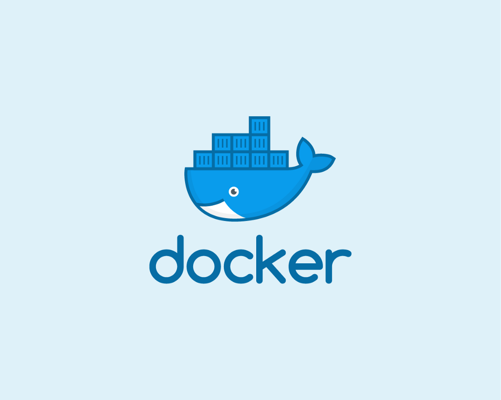
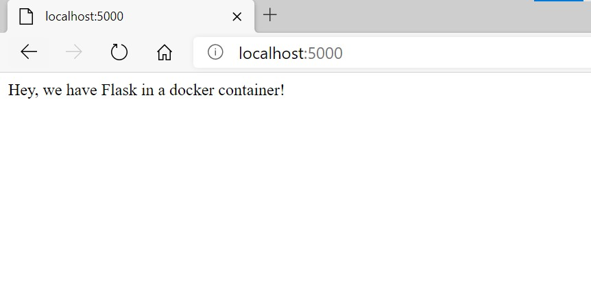

The value proposition of **Docker Containers** is that they allow you to create applications that run practically everywhere. While this makes it sound like it's a nightmare to create, it's actually pretty simple!



In order to demonstrate this, we'll attempt to *dockerize* (the act of transforming a standalone application to a container-compatible one) a simple Flask application. By the end of this article, you'll be up and running with Docker containers!

*All the files can be found in this [repo](https://github.com/adrianmarkperea/docker-flask-demo).*

Let's first create a folder for our project:

```bash
$ mkdir docker-flask-demo && cd docker-flask-demo
```

Then, let's create our simple Flask application and name it `app.py`:

```python
# docker-flask-demo/app.py
from Flask import flask
app = Flask(__name__)


@app.route('/')
def hello_world():
    return 'Hello world, from your container!'


if __name__ == '__main__':
    app.run(debug=True, host='0.0.0.0')
```

You might be thinking that we need to install Flask at this point. But instead of installing Flask (and any other dependencies) in our own local system, **we'll instruct Docker to install these dependencies inside the container**. By doing this, our containers can run independently in any environment. Neat, right?

One thing that we have to do is to tell our container what dependencies are needed. Since we're using Python, what we need is a `requirements.txt` file. 

Let's create this file and tell our container that we need the Flask module:

```python
# docker-flask-demo/requirements.txt

flask
```

The last thing that we need is a `Dockerfile`. The Dockerfile is responsible for  specifying our [Docker Image](https://docs.docker.com/engine/reference/commandline/images/), which we'll then use as a blueprint for our containers. Think of it as a container prototype.

Create the `Dockerfile` (no extensions) in the project folder and write the following:

```docker
FROM ubuntu:18.04

RUN apt-get update -y && \
    apt-get install -y python-pip python-dev

COPY . /app

WORKDIR /app

RUN pip install -r requirements.txt

ENTRYPOINT [ "python" ]

CMD [ "app.py" ]
```

Let's look at the different parts of this file one by one:

+ **FROM**: Specifies the base image to be used for all the commands. This allows us to reuse existing Docker images and add our own rules. In this case, we're using with a clean Ubuntu image.
+ **RUN**: Allows us to run shell commands. We're using this to update our system and install system dependencies.
+ **COPY**: Copies files from our local system to the container file system. Here we're copying our local `requirements.txt` to the container's `/app/` folder.
+ **WORKDIR**: Changes the current working directory in the container. All the subsequent commands after this command will be ran in this directory. Here we're moving to the `/app/` folder.
+ We then use `RUN` to install our application requirements using `pip`.
+ **ENTRYPOINT**: Determines the executable that will be invoked when we run our container.
+ **CMD**: Specifies default arguments to our executable. This means that by default our container will run our flask application.

Let's now build this image! Run the following command:

```bash
$ docker build -t docker-flask-demo:latest .
```

This command tells docker to fetch the `Dockerfile` present in the current directory (hence the `.` at the end). Docker then uses this file to create an image and names it `docker-flask-demo` with the tag `latest`.

We won't delve much into tags for now, but think of them as ways to specify the version of your image. In this case, we're saying that this build is the latest verion of our image.

After the command runs, we can see that our image is now installed using the following command:

```bash
$ sudo docker image ls
```

This would give a result similar to the following:

```bash
REPOSITORY          TAG                 IMAGE ID            CREATED             SIZE
docker-flask-demo   latest              676bb635f471        18 seconds ago      446MB
```

We can finally use this image to create our own containers! A simple way to do this is through the following command:

```bash
$ docker run -d -p 5000:5000 docker-flask-demo
```

After running this command, our container should be up and running our application! Go open your browser and go to `localhost:5000`. You should see the following page:



The `docker run` command that we just ran creates and runs a container based on the `docker-flask-demo` image we created. The `-d` option allows us to run the container in the background, and the `-p` command maps the port 5000 of our local system with the port 5000 of the container. We add this command because by default, the ports of the container are not accessible by our local system.

We can see all our running containers by issuing the following command:

```bash
$ docker ps
```

Which should give the following output:

```bash
CONTAINER ID        IMAGE               COMMAND             CREATED             STATUS              PORTS                    NAMES
d95eb8940835        docker-flask-demo   "python app.py"     4 minutes ago       Up 4 minutes        0.0.0.0:5000->5000/tcp   keen_jackson
```

And finally, we can stop our container (and consequently, our application) by issuing the following command together with the `CONTAINER ID` of our container:

```bash
$ docker stop d95eb8940835
```

And there you have it! We successfully dockerized our Flask application and made it run in a container. We installed all the dependencies inside the container, so we can be sure that this application will run in any environment.
